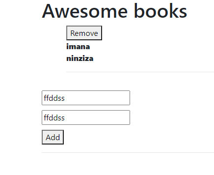

# Project Name

> tHIS project is designed to add and remove element from localstorage .

Additional description about the project and its features.

## Built With

- Javascript
- html
- Css

## Authors

👤 **Mucyo claude**

## 🤝 Contributing

Contributions, issues, and feature requests are welcome!

Feel free to check the [issues page](../../issues/).

## Show your support

Give a ⭐️ if you like this project!

## Acknowledgments

- Everyone

## 📝 License

This project is [MIT](./MIT.md) licensed.
